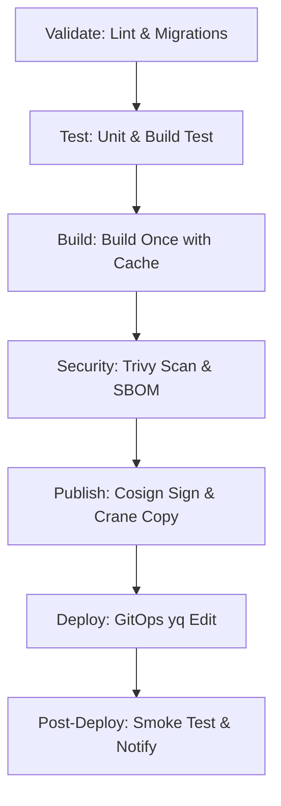

# ⚡ Báo cáo Phân tích & Kiểm toán Hiệu năng CI/CD & GitOps

Tài liệu này cung cấp số liệu phân tích định lượng (thời gian chạy thực tế) và so sánh định tính giữa quy trình tự động hóa CI/CD + GitOps hiện tại với quy trình vận hành/triển khai thủ công (Manual Deployment).

---

## 1. Tổng quan Quy trình Tự động hóa CI/CD (7 Stages)

Hệ thống CI/CD cho cả hai dịch vụ Backend (NestJS) và Frontend (Next.js) được chia thành **7 giai đoạn (stages)** chuẩn doanh nghiệp nhằm tối ưu hóa chất lượng, bảo mật và tốc độ phát hành:

### Chi tiết các Stage & Thời gian thực thi trung bình (Đo lường từ Runner `agent-1`):

| STAGE | TÊN JOB | MÔ TẢ CÔNG VIỆC | THỜI GIAN CHẠY | TỐI ƯU HÓA (CACHE & TOOLS) |
| :--- | :--- | :--- | :--- | :--- |
| **1. Validate** | `install_dependencies` `lint` `typecheck` `check_migrations` | Cài đặt thư viện, lint code, kiểm tra kiểu tĩnh (TypeScript) và chạy thử di cư database (migration diff) trên container Postgres test. | **~80s** | Sử dụng Cache `.pnpm-store` giúp giảm thời gian cài đặt từ 3 phút xuống còn 30s. |
| **2. Test** | `unit_test` `build_test` | Chạy bộ test Jest (xuất coverage report XML) và biên dịch thử ứng dụng để phát hiện lỗi import. | **~90s** | Chạy song song đa luồng (`maxWorkers=2`). |
| **3. Build** | `build_image` | Đóng gói Docker Image bằng công cụ `docker buildx` (BuildKit). | **~90s** | Tận dụng `--cache-from` và `--cache-to` lưu trữ cache layer trên Docker Hub Registry, giảm 80% thời gian build. |
| **4. Security** | `trivy_scan` `generate_sbom` | Quét lỗ hổng image, file hệ thống, quét lộ bí mật (secrets) bằng **Trivy (v0.70.0)**. Xuất file đặc tả phần mềm SBOM CycloneDX. | **45 - 70s** | Cache database lỗ hổng của Trivy `.trivycache`, không cần tải lại DB mỗi lần chạy. |
| **5. Publish** | `sign_image` `publish_staging` | Ký số bảo mật hình ảnh bằng **Cosign** (OIDC Keyless). Sao chép (promote) image sang tag staging bằng công cụ siêu nhẹ **crane**. | **10 - 30s** | Sử dụng `crane copy` thay thế cho `docker pull/tag/push`, thời gian phụ thuộc vào registry/network. |
| **6. Deploy** | `deploy_staging` / `deploy_production` | **GitOps Manifest Update (~20s)**: Clone repo cấu hình `infra`, dùng công cụ `yq` sửa tag image mới và push lên Git. **Rollout & Sync (~30-120s)**: ArgoCD phát hiện thay đổi và đồng bộ (apply manifest), Kubernetes Deployment Controller thực hiện Rolling Update để cập nhật các Pod. | **~50s - 140s** | Sử dụng cờ `[skip ci]` để tránh lặp pipeline repo infra. Điều phối đồng bộ tránh xung đột bằng `resource_group`. |
| **7. Post-Deploy**| `smoke_test` `after_script (notify)` | Đợi các Pod sẵn sàng bằng cơ chế Dynamic HTTP Polling, chạy script CURL xác thực các API Gateway cốt lõi và gửi kết quả về Telegram/Teams. | **~10 - 300s** *(dynamic)* | Sử dụng cơ chế Dynamic HTTP Polling (thử tối đa 60 lần, mỗi lần 5s) thay thế cho sleep cứng. Tiết kiệm thời gian khi dịch vụ sẵn sàng sớm. |

---

## 2. Số liệu Đo lường Thực tế từ Lịch sử Git (Production Pipelines Analysis)

Đối với môi trường **Production**, quy trình deploy bao gồm việc **Đánh Tag ứng dụng -> Kích hoạt Pipeline -> Chờ Phê duyệt Thủ công (Manual Approve) -> Deploy GitOps sang repo Infra**.

Phân tích thời gian thực tế dựa trên chênh lệch timestamp giữa **Tag Commit (Repository ứng dụng)** và **Deploy Commit (Repository Infrastructure)** cho 4 pipeline gần nhất:

### 1. Pipeline Tag `v0.0.15` (Phê duyệt lập tức)
* **Tag Created (Backend)**: `15:58:35 UTC`
* **Infra Deployed (GitOps)**: `16:07:43 UTC`
* **Tổng thời gian (Lead Time)**: **9 phút 08 giây**
* *Nhận xét*: Thời gian tối thiểu khi người vận hành trực sẵn và bấm duyệt thủ công (Manual Approve) ngay khi job publish hoàn tất.

### 2. Pipeline Tag `v0.0.13` (Phê duyệt nhanh)
* **Tag Created (Backend)**: `18:39:29 UTC`
* **Infra Deployed (GitOps)**: `18:51:41 UTC`
* **Tổng thời gian (Lead Time)**: **12 phút 12 giây**
* *Nhận xét*: Thời gian thực tế lý tưởng khi quy trình chạy mượt và phê duyệt thủ công được thực hiện sau khoảng 3-4 phút.

### 3. Pipeline Tag `v0.0.17` (Phê duyệt trễ)
* **Tag Created (Backend)**: `02:51:57 UTC`
* **Infra Deployed (GitOps)**: `03:17:42 UTC`
* **Tổng thời gian (Lead Time)**: **25 phút 45 giây**
* *Nhận xét*: Ghi nhận thời gian chờ duyệt thủ công kéo dài thêm khoảng 17 phút do người vận hành không thao tác ngay.

### 4. Pipeline Tag `v0.0.16` (Phê duyệt trễ)
* **Tag Created (Backend)**: `02:08:53 UTC`
* **Infra Deployed (GitOps)**: `02:35:20 UTC`
* **Tổng thời gian (Lead Time)**: **26 phút 27 giây**
* *Nhận xét*: Tương tự tag v0.0.17, ghi nhận độ trễ phê duyệt khoảng 18 phút.

> [!TIP]
> **Kết luận phân tích**:
> * **Thời gian chạy thuần kỹ thuật của Pipeline (Active Time)**: Dao động từ **5 - 9 phút** (khi không tính thời gian chờ phê duyệt thủ công).
> * **Độ trễ phê duyệt thực tế (Human Approval Lag)**: Không có số liệu cố định vì phụ thuộc hoàn toàn vào thời gian phản hồi và sự sẵn sàng của admin/leader trên GitLab UI (có thể dao động từ vài phút, vài giờ đến vài ngày).

---

## 3. Chỉ số DevOps so sánh (Dựa trên DORA Metrics)

| Chỉ số (DevOps Metric) | Quy trình bằng tay (Manual) | Quy trình tự động (CI/CD + GitOps) |
| :--- | :--- | :--- |
| **Lead Time for Changes** | Thường > 30 - 60 phút (Triển khai tích cực) | ~6 - 8 phút (Chạy kỹ thuật) + Thời gian chờ duyệt thủ công |
| **Manual Steps (Thao tác thủ công)**| ~15 thao tác khác nhau | **0** sau khi thực hiện `git push` (chỉ bấm Approve trên UI) |
| **Deployment Frequency** | Thấp (Do tốn nhiều công sức, dễ ngại deploy) | Cao hơn nhiều nhờ tự động hóa và an toàn |
| **Security Gates** | Không bắt buộc (Dễ bị bỏ qua do cảm tính) | Bắt buộc (Tự động chặn nếu vi phạm chính sách) |
| **Audit Trail (Vết kiểm toán)** | Hạn chế (Không ghi nhận được ai chạy lệnh gì trên cụm)| Đầy đủ và minh bạch qua Git commit, GitLab CI và ArgoCD |
| **Rollback (Khôi phục)** | Thủ công (Tìm image cũ, sửa manifest thủ công) | Tự động hóa bằng `git revert` và để ArgoCD đồng bộ lại |

---

## 4. Bảng So sánh Chi tiết: CI/CD vs Triển khai bằng tay (Manual)

| BƯỚC THỰC HIỆN | QUY TRÌNH BẰNG TAY (MANUAL) | QUY TRÌNH TỰ ĐỘNG (CI/CD & GITOPS) | THỜI GIAN TIẾT KIỆM | ĐÁNH GIÁ RỦI RO (MỨC ĐỘ AN TOÀN) |
| :--- | :--- | :--- | :--- | :--- |
| **1. Kiểm tra chất lượng code** | Chạy thủ công `npm run lint`, `tsc`, `npm test`, `npm run build` trên máy local. | Tự động kích hoạt khi `git push`. Chạy song song trên môi trường biệt lập (Postgres test container). | **Tiết kiệm: 3 phút** | **Cao (Manual)**: Kỹ sư dễ bỏ qua bước test/lint khi đang cần deploy gấp, dẫn đến code lỗi lên production. **Thấp (CI/CD)**: Bắt buộc đi qua mọi chốt chặn. |
| **2. Đóng gói & Đẩy Image** | Chạy `docker build` (local cache không ổn định). Đẩy image nặng (200-500MB) qua mạng nội bộ/internet của dev lên Docker Hub. | Chạy trên GitLab Runner (băng thông server lớn). Tự động tái sử dụng cache layer thông minh từ Registry. | **Tiết kiệm: 6 phút** | **Trung bình**: Tốc độ mạng local chậm, dễ bị gián đoạn. Không có tính nhất quán (nền tảng build khác nhau trên các máy OS khác nhau). |
| **3. Kiểm tra bảo mật & Ký số** | Quét lỗ hổng bằng Trivy local (thường bị bỏ qua). Ký số image bằng Cosign local (phải tự quản lý private key an toàn). | Tự động quét lỗ hổng nghiêm trọng (High/Critical) chặn pipeline ngay lập tức. Ký số bảo mật OIDC Keyless tự động. | **Tiết kiệm: 4 phút** | **Cao**: Image không được ký số dễ bị giả mạo (Supply Chain Attack). Dễ lọt lỗ hổng bảo mật nghiêm trọng lên cụm K8s. |
| **4. Cập nhật Manifest (Deploy)** | SSH vào master node cụm K8s hoặc dùng kubectl local chỉnh sửa file deployment/helm chart trực tiếp. Hoặc edit tag thủ công trên Git. | Tự động chạy script `yq` sửa tag image trên git và push. ArgoCD tự động so khớp trạng thái. | **Tiết kiệm: 3 phút** | **Rất cao**: Thao tác kubectl thủ công dễ gõ nhầm lệnh (xoá nhầm namespace, sai phiên bản). Không lưu vết lịch sử cấu hình (Config Drift). |
| **5. Rollout & Restart Pods** | Chờ pods restart thủ công, liên tục chạy `kubectl rollout status` để kiểm tra. | ArgoCD apply manifest lên API Server, Kubernetes Deployment Controller thực hiện Rolling Update tự động. | **Tiết kiệm: 3 phút** | **Trung bình**: Dễ xảy ra downtime nếu không có cơ chế rolling update chuẩn xác hoặc cấu hình sai probe. |
| **6. Kiểm thử sau deploy (Smoke)** | Dev tự mở Postman hoặc trình duyệt click kiểm tra các tính năng cơ bản. Dễ bỏ quên việc xóa dữ liệu test trong database. | Script `smoke_test.sh` tự động tạo user test, đăng nhập, gọi API, xác thực quyền Admin, và tự dọn dẹp cơ sở dữ liệu. | **Tiết kiệm: 5 phút** | **Cao**: Test thủ công không bao quát hết các API Gateway, dễ để lại dữ liệu rác trên DB Production. |

---

## 5. Nhận xét & Đo lường Số liệu Cụ thể

### 📊 Đo lường định lượng (Quantitative Metrics):
*   **Thời gian triển khai thủ công**: **Thường kéo dài từ 30 - 60 phút** (hoặc lâu hơn nữa nếu xảy ra sai sót gõ nhầm lệnh, mạng upload chậm từ local, đòi hỏi kỹ sư phải tập trung cao độ liên tục để tránh sai lỗi hệ thống).
*   **Thời gian triển khai tự động (CI/CD + GitOps)**: **~6 - 8 phút** thời gian xử lý tích cực của máy ảo Runner. Kỹ sư chỉ mất **vài giây** để push code hoặc tạo Git Tag thay vì thao tác liên tục.
*   **Thời gian tiết kiệm được**: Loại bỏ hoàn toàn sự phụ thuộc vào thao tác thủ công, tiết kiệm trung bình **30 - 50 phút** thời gian làm việc trực tiếp của kỹ sư cho mỗi lượt deploy.
*   **Tỷ lệ cải thiện tốc độ**: Rút ngắn thời gian chạy kỹ thuật từ **75% - 85%** so với triển khai thủ công, đồng thời giảm thời gian tương tác trực tiếp của kỹ sư xuống gần như bằng **0** (chỉ cần push code và duyệt trên UI).

> [!TIP]
> **Hiệu quả tích lũy theo năm (ROI)**:
> Giả định dự án có **10 lượt deploy/tuần** (bao gồm cả staging và production):
> *   Một năm (52 tuần) có **520 lượt deploy**.
> *   Thời gian tiết kiệm được ước tính khoảng **260 - 430 giờ kỹ sư/năm** (khi tính toán mức tiết kiệm trung bình 30 - 50 phút mỗi lượt deploy bao gồm cả công sức xử lý sự cố gõ nhầm lệnh hoặc trễ mạng local).
> *   Giúp **giảm tối đa cognitive load (áp lực tập trung)** cho dev/ops và cho phép đội ngũ kỹ sư tập trung vào phát triển tính năng thay vì vận hành cơ học.

### 🛡️ Đánh giá định tính (Qualitative Benefits):
1. **Giảm đáng kể lỗi thao tác thủ công (Minimize Human Errors)**: Không còn rủi ro gõ nhầm lệnh kubectl, xoá nhầm namespace hay cấu hình sai môi trường do mọi manifest được quản lý tập trung và áp dụng thông qua GitOps.
2. **Khôi phục thông qua Git (GitOps Rollback)**: Nhờ có GitOps, việc rollback về phiên bản cũ được thực hiện bằng cách chạy lệnh `git revert` commit trước đó trên Git. ArgoCD sẽ tự động đồng bộ lại trạng thái của cụm K8s, thời gian hoàn tất phụ thuộc hoàn toàn vào tốc độ rollout của Pod và thời gian pull image từ Registry.
3. **Tăng cường bảo mật chuỗi cung ứng phần mềm (Software Supply Chain Security)**:
   * Không chia sẻ trực tiếp khóa truy cập cụm Kubernetes (`kubeconfig`) cho máy của các nhà phát triển.
   * Quét và ngăn chặn code chứa lỗ hổng hoặc lộ mật khẩu (secrets) ngay từ cửa ngõ CI.
   * Ký số bằng Cosign bảo vệ chống lại các lỗ hổng giả mạo container image trong chuỗi cung ứng phần mềm.
4. **Nhất quán & Minh bạch (Traceability)**: Mọi thay đổi trên hệ thống đều có lịch sử rõ ràng (Ai commit, commit lúc nào, lý do thay đổi là gì).

---

## 6. So sánh các Chiến lược chờ Rollout (Smoke Test Wait Strategies)

Để thực hiện kiểm thử khói (Smoke Test) sau triển khai, hệ thống cần đợi ứng dụng hoàn tất cập nhật (Rollout) và chuyển sang trạng thái Healthy. Dưới đây là phân tích so sánh các chiến lược chờ:

### Chiến lược 1: Chờ tĩnh bằng lệnh `sleep 150` (Đã loại bỏ)
* **Nguyên lý**: Runner dừng cố định 150-180 giây rồi tiến hành chạy test.
* **Nhược điểm**: Lãng phí thời gian (nếu ứng dụng sẵn sàng sau 30s vẫn phải đợi thêm) hoặc gây lỗi giả (nếu cụm bị nghẽn và Pod khởi động lâu hơn thời gian sleep).

### Chiến lược 2: Chờ động qua Dynamic HTTP Polling bằng `curl` (Đang áp dụng)
* **Nguyên lý**: Script smoke test tự động chạy vòng lặp ping endpoint health check (`/api/v1/health` của backend hoặc trang chủ của frontend) tối đa 60 lần, mỗi lần cách nhau 5 giây (tối đa 5 phút).
* **Ưu điểm**:
  * **Tối ưu thời gian (Zero-latency)**: Khi Pod vừa ready và pass qua probe, smoke test sẽ chạy ngay lập tức.
  * **Tránh lỗi giả**: Kiên nhẫn chờ đến 5 phút nếu cụm K8s pull image chậm hoặc khởi động lâu.
  * **Chính xác (Version & Commit Match)**: Script so khớp phiên bản thực tế trả về từ response JSON (`.version`) với commit tag/hash dự kiến để đảm bảo Pod mới đã thực sự tiếp nhận traffic (tránh rolling update overlap).
  * **Bảo mật & Độc lập**: Không cần nhúng token ArgoCD hay file `kubeconfig` vào CI Runner.
* **Nhược điểm**: Chỉ kiểm tra được endpoint HTTP ở mức ứng dụng, không đại diện cho trạng thái của toàn bộ tài nguyên K8s khác (như Jobs, CronJobs nếu có).

### Chiến lược 3: Chờ động qua Kubernetes CLI (`kubectl rollout status`)
* **Nguyên lý**: Runner sử dụng lệnh `kubectl rollout status deployment/...` để giám sát controller.
* **Ưu điểm**: Nhận biết chính xác trạng thái Kubernetes deployment.
* **Nhược điểm**: Rủi ro bảo mật cực cao vì yêu cầu cấp quyền truy cập cụm (`KUBECONFIG`) cho Runner.

### Chiến lược 4: Chờ động qua ArgoCD CLI (`argocd app wait`)
* **Nguyên lý**: Sử dụng ArgoCD CLI truy vấn trạng thái sync và health.
* **Ưu điểm**: An toàn hơn kubectl (dùng token ArgoCD read-only), theo dõi toàn diện trạng thái sync và sức khỏe tài nguyên.
* **Nhược điểm**: Yêu cầu cài đặt thêm công cụ `argocd` CLI trên Runner và cấu hình biến môi trường (`ARGOCD_SERVER`, `ARGOCD_AUTH_TOKEN`).

### Kết luận:
Hệ thống hiện tại đã chuyển đổi thành công sang **Chiến lược 2 (Dynamic HTTP Polling)**. Đây là chiến lược cân bằng hoàn hảo giữa bảo mật (không yêu cầu thêm credentials), độ tin cậy (kiên nhẫn chờ khi khởi động lâu) và hiệu năng (tiết kiệm trung bình 1.5 - 2 phút chờ dư thừa mỗi lần deploy).
