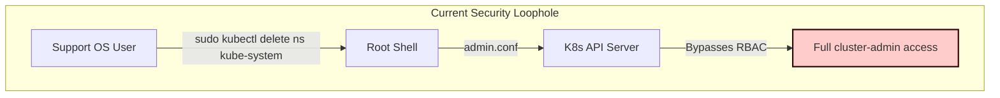
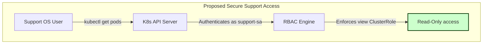

# RBAC Security Audit & Recommendation Report

This document presents a comprehensive security audit of the Role-Based Access Control (RBAC) configurations applied to the Kubernetes cluster and associated repository configurations. It identifies key risks, provides concrete recommendations, and outlines an action plan to align the platform with the principle of least privilege.

---

## Executive Summary

The cluster implements strong boundary protections, such as Traefik IP AllowLists to restrict access to sensitive admin consoles (ArgoCD, Kubernetes Dashboard, Grafana). However, the internal RBAC audit revealed a **critical security loophole** in the OS-level `sudoers` configuration, where the `support` user can escalate privileges to full `cluster-admin` via `sudo kubectl`.

### Quick Stats
| Resource Type | Total Found | Critical Findings | Remediation Difficulty |
| :--- | :---: | :---: | :---: |
| **ClusterRoleBindings** | 38 | 0 (All system/standard) | - |
| **Namespaced RoleBindings** | 31 | 0 (Well scoped) | - |
| **Host-level Sudoers** | 1 | 1 (Critical escalation) | Easy |
| **Application Pods SA** | 4 | 2 (Automounted tokens) | Easy |

---

## Current RBAC Inventory

### 1. High-Privilege Cluster Access (`cluster-admin`)
The following subjects have unrestricted administrative access (`cluster-admin`) across the entire cluster:

| Binding Name | Subject Type | Subject Namespace / Group | Purpose |
| :--- | :--- | :--- | :--- |
| `admin-user` | `ServiceAccount` | `kubernetes-dashboard/admin-user` | Administrative login to the Kubernetes Dashboard |
| `cluster-admin` | `Group` | `system:masters` | Default Kubernetes superuser group |
| `kubeadm:cluster-admins` | `Group` | `kubeadm:cluster-admins` | Bootstrapping admin group |
| `longhorn-pre-upgrade-admin-binding` | `ServiceAccount` | `longhorn-system/longhorn-service-account` | Temporary storage engine upgrade permissions |
| `longhorn-support-bundle` | `ServiceAccount` | `longhorn-system/longhorn-support-bundle` | Diagnostic bundle collector for Longhorn storage |
| `velero-server` | `ServiceAccount` | `velero/velero-server` | Velero backup/restore server operations |

### 2. Custom & Platform RoleBindings (Namespaced)
Key namespaced roles mapped to platform service accounts:

*   **`argocd` Namespace**: Standard controller permissions. The `argocd-application-controller` runs with cluster-wide wildcard permissions (`*` on `*`) to facilitate GitOps deployments.
*   **`infra` Namespace**: `traefik` runs with a custom `traefik-infra` ClusterRole providing read-only ingress discovery and secret access (for TLS).
*   **`velero` Namespace**: `velero-secret-reader-binding` binds `infra/etcd-backup-sa` to read the `cloud-credentials` secret in the `velero` namespace. This is properly constrained using `resourceNames: ["cloud-credentials"]`.

---

## Security Assessment & Findings

### Finding 1: Sudoers Kubectl Privilege Escalation (CRITICAL)
> [!WARNING]
> The OS-level sudoers file defined in `permission_support.md` allows the `support` user to run `kubectl` as root without a password:
> `K8S_SUPPORT ALL=(root) NOPASSWD: K8S_READ, K8S_ACTION`
> Since `/usr/bin/kubectl` runs as root, it automatically utilizes root's default kubeconfig (`/etc/kubernetes/admin.conf`), granting **full cluster-admin privileges**. The support user can execute any administrative command (`create`, `delete`, `apply`, etc.), rendering the read-only restriction of `K8S_READ` ineffective.



### Finding 2: Default ServiceAccount Token Automounting (LOW)
> [!NOTE]
> Pods in the `blog-prod` and `blog-staging` namespaces run using the `default` ServiceAccount. By default, Kubernetes automounts the ServiceAccount token inside every pod container at `/var/run/secrets/kubernetes.io/serviceaccount/token`. Since these application pods do not interface with the Kubernetes API, mounting this token presents an unnecessary lateral movement risk if a pod is compromised.

---

## Proposed Action Plan & Remediation

We propose a three-step action plan to address these findings.



### Step 1: Secure support access and remove sudoers `kubectl` access
We will create a Kubernetes ServiceAccount for support, bind it to the default `view` ClusterRole, generate a kubeconfig file for it, and update `/etc/sudoers.d/k8s-support` to deny raw `sudo kubectl`.

#### 1. Define Kubernetes-native read-only access
Create `infra/platform/support-rbac.yaml`:
```yaml
apiVersion: v1
kind: ServiceAccount
metadata:
  name: support-user
  namespace: infra
---
apiVersion: rbac.authorization.k8s.io/v1
kind: ClusterRoleBinding
metadata:
  name: support-user-view-binding
roleRef:
  apiGroup: rbac.authorization.k8s.io
  kind: ClusterRole
  name: view # Built-in read-only cluster role
subjects:
- kind: ServiceAccount
  name: support-user
  namespace: infra
```

#### 2. Update `permission_support.md`
Update the document to remove `kubectl` from sudo commands and replace it with a native read-only configuration setup.

### Step 2: Disable ServiceAccount Token Automounting for Applications
Configure the `default` ServiceAccounts in `blog-prod` and `blog-staging` namespaces to disable token mounting.

#### Update Helm Values / Manifests for Blog Applications
Add `automountServiceAccountToken: false` to the pod specs or service accounts.
