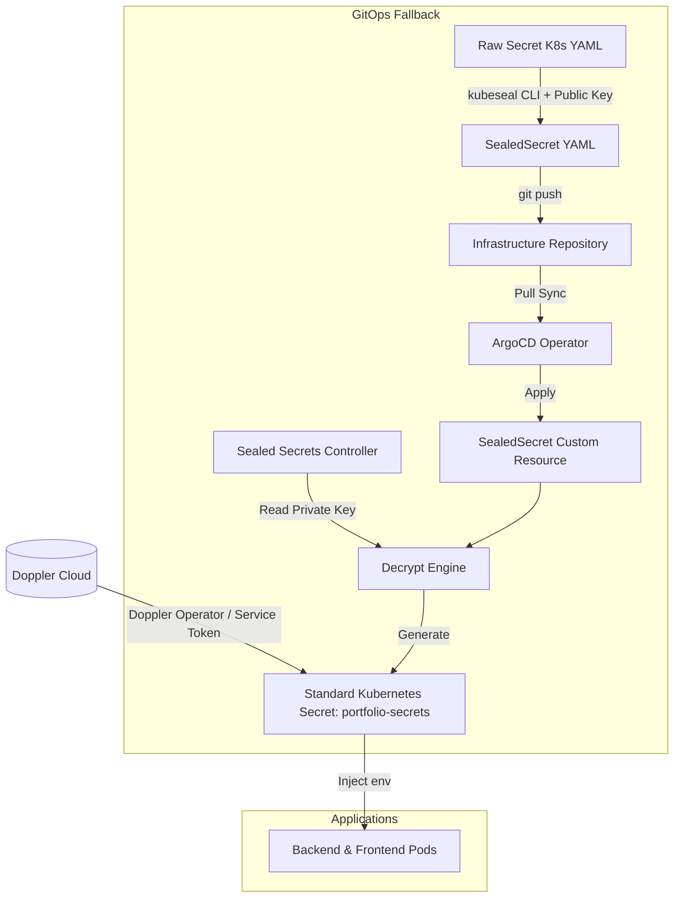

# 🔐 Secrets Management (Doppler & Sealed Secrets)

Tài liệu này đặc tả quy trình quản lý thông tin nhạy cảm (Secrets) trong dự án tuân theo triết lý **GitOps**. Dự án sử dụng giải pháp **Doppler** làm hệ thống quản lý chính (Primary) và duy trì **Bitnami Sealed Secrets** làm phương án dự phòng (Backup/Fallback) cũng như để phân phối mã thông báo Doppler đến các vùng chứa một cách an toàn.

---

## 1. Kiến trúc Quản lý Secrets (Hybrid Model)

Dự án áp dụng mô hình quản lý hỗn hợp nhằm tối ưu giữa sự tiện lợi của SaaS và tính độc lập tự vận hành (Self-hosted/Git-secured) để phòng ngừa rủi ro mất kết nối.

```
                  ┌──────────────────────────┐
                  │   Doppler Cloud (SaaS)   │
                  └─────────────┬────────────┘
                                │ (Service Token)
                                ▼
  ┌─────────────┐       ┌──────────────┐       ┌─────────────────┐
  │  Git Repo   ├──────>│  Kubernetes  ├──────>│ Running App Pod │
  │ (Encrypted) │       │ Sealed Secret│       │ (Decrypted Env) │
  └─────────────┘       └──────────────┘       └─────────────────┘
```

*   **Hệ thống chính (Doppler - SaaS):** Cung cấp giao diện Web UI trực quan, cho phép tham chiếu chéo (secrets referencing), đồng bộ trực tiếp local qua CLI và tự động đồng bộ lên Kubernetes qua Operator.
*   **Hệ thống dự phòng (Sealed Secrets - GitOps):** Mã hóa bất đối xứng secrets và lưu file mã hóa trên Git. Khi Doppler offline, chỉ cần đổi cấu hình để giải mã Sealed Secrets cục bộ trong cụm.

---

## 2. Luồng hoạt động mã hóa & giải mã



---

## 3. Phân tách Cấu hình (Git Values) và Bí mật (Doppler)

Dự án tuân theo nguyên tắc phân tách rõ ràng giữa cấu hình công khai và thông tin nhạy cảm để giảm thiểu rủi ro bảo mật thông tin:

### A. Secrets nhạy cảm (Quản lý trên Doppler / Sealed Secrets fallback)
Chỉ có các thông tin nhạy cảm sau mới được đưa vào Doppler để mã hóa:
*   `DATABASE_URL`: Chuỗi kết nối cơ sở dữ liệu (chứa thông tin tài khoản và mật khẩu truy cập).
*   `JWT_SECRET`: Khóa ký token xác thực JWT dùng cho phiên đăng nhập.
*   `MINIO_ACCESS_KEY` & `MINIO_SECRET_KEY`: Khóa kết nối đến Cloudflare R2 / S3 Storage.
*   `TURNSTILE_SECRET_KEY`: Khóa riêng tư xác thực CAPTCHA của Cloudflare.
*   `REDIS_PASSWORD`: Mật khẩu bảo mật dùng để xác thực phiên kết nối với Redis.

### B. Biến cấu hình công khai (Lưu trong Helm values.yaml trên Git)
Các biến không nhạy cảm được lưu dưới dạng plain-text trên Git để dễ theo dõi thay đổi hạ tầng:
*   Múi giờ & Cổng: `TZ`, `PORT`, `HOSTNAME`
*   Origins & Domain: `ALLOWED_ORIGINS`, `MINIO_ENDPOINT`, `MINIO_CDN_URL`, `MINIO_BUCKET`
*   Flag cấu hình: `BYPASS_TURNSTILE`, `STORAGE_TYPE`, `MINIO_USE_SSL`

---

## 4. Hướng dẫn cho Nhà phát triển (Local Development với Doppler)

Thay vì chép file `.env` thủ công giữa các nhà phát triển, chúng ta lấy secrets trực tiếp từ Doppler Cloud để đảm bảo đồng bộ:

### Bước 1: Cài đặt Doppler CLI
*   **macOS:** `brew install dopplerhq/cli/doppler`
*   **Windows (PowerShell):** `iwr -useb https://scoop.doppler.com/install.ps1 | iex` hoặc dùng Chocolatey: `choco install doppler`
*   **Linux:** Theo hướng dẫn chính thức từ trang chủ Doppler.

### Bước 2: Liên kết thư mục local với Doppler
Chạy lệnh sau tại thư mục gốc của backend hoặc frontend:
```bash
doppler login
doppler setup
```
*(Chọn dự án `blog-portfolio` và cấu hình môi trường tương ứng, ví dụ: `dev`).*

### Bước 3: Khởi chạy dự án local
Chạy dự án thông qua lệnh tích hợp sẵn:
```bash
pnpm dev:doppler
```
Doppler CLI sẽ tự động inject các biến môi trường trực tiếp vào tiến trình Node.js mà không ghi bất kỳ file `.env` vật lý nào xuống ổ cứng.

---

## 5. Quản lý Secrets trên Kubernetes (GitOps)

Chúng ta cấu hình điều hướng secrets qua biến `secretsProvider` trong tệp `values.yaml` của Helm Chart ứng dụng.

### 5.1 Cấu hình Phân quyền ArgoCD Project (AppProject Whitelisting)
Do Doppler Operator được triển khai mặc định trên namespace `doppler-operator-system`, cấu hình ArgoCD `AppProject` của bạn phải cho phép deploy và quản lý tài nguyên tại namespace này.

Cập nhật tệp [`platform-project.yaml`](file:///d:/DATA/Portfolio/infra/argocd/projects/platform-project.yaml) trước khi deploy operator:
```yaml
spec:
  destinations:
  - namespace: doppler-operator-system
    server: https://kubernetes.default.svc
```

### 5.2 Mã hóa Service Token của Doppler (GitOps hoàn toàn)

Để Doppler Operator tự động đồng bộ mà không cần chạy lệnh tạo secret thủ công trên cụm:

1.  **Lấy Service Token** của môi trường trên Doppler Dashboard (tiền tố `dp.st.stg.` cho staging hoặc `dp.st.prd.` cho production).
2.  **Mã hóa Service Token** qua chứng chỉ `sealed-cert.pem`.

> [!WARNING]
> **Cảnh báo lỗi luồng nhị phân trên Windows PowerShell**:
> Khi sử dụng lệnh pipe truyền thống `[System.Text.Encoding]::UTF8.GetBytes("token") | .\kubeseal.exe`, PowerShell sẽ chuyển đổi mảng byte thành một danh sách chuỗi số nguyên phân tách bằng dòng mới (ví dụ: `100\r\n112...`), dẫn đến việc `kubeseal` mã hóa sai dữ liệu.
>
> Để khắc phục, bạn **bắt buộc** phải ghi token vào một file tạm và điều hướng file đó vào `kubeseal` thông qua CMD:

*   **Staging** (namespace `blog-staging`):
    ```powershell
    [System.IO.File]::WriteAllBytes("temp-stg.txt", [System.Text.Encoding]::UTF8.GetBytes("dp.st.stg.YOUR_STAGING_TOKEN_PLACEHOLDER"))
    cmd /c "kubeseal --cert .\sealed-cert.pem --raw --name doppler-token-secret --namespace blog-staging < temp-stg.txt"
    Remove-Item temp-stg.txt
    ```
*   **Production** (namespace `blog-prod`):
    ```powershell
    [System.IO.File]::WriteAllBytes("temp-prd.txt", [System.Text.Encoding]::UTF8.GetBytes("dp.st.prd.YOUR_PRODUCTION_TOKEN_PLACEHOLDER"))
    cmd /c "kubeseal --cert .\sealed-cert.pem --raw --name doppler-token-secret --namespace blog-prod < temp-prd.txt"
    Remove-Item temp-prd.txt
    ```

3.  **Dán chuỗi đã mã hóa** vào tệp cấu hình của môi trường tương ứng dưới trường `doppler.encryptedToken`:
    *   **Staging:** [backend-values.yaml (Staging)](file:///d:/DATA/Portfolio/infra/environments/staging/backend-values.yaml)
    *   **Production:** [backend-values.yaml (Production)](file:///d:/DATA/Portfolio/infra/environments/production/backend-values.yaml)

```yaml
doppler:
  tokenSecretName: "doppler-token-secret"
  encryptedToken: "CHUỖI_MÃ_HÓA_TOKEN_Ở_TRÊN"
```

### 5.3 Cấu trúc Custom Resource DopplerSecret
Doppler Operator sử dụng Custom Resource `DopplerSecret` để quản lý việc kéo secrets. Cấu trúc chuẩn xác định trong Helm chart:

```yaml
apiVersion: secrets.doppler.com/v1alpha1
kind: DopplerSecret
metadata:
  name: portfolio-backend-staging-doppler-sync
  namespace: blog-staging
spec:
  tokenSecret:
    name: doppler-token-secret
  managedSecret:
    name: portfolio-secrets
```
*Lưu ý:* Trường cấu hình là `tokenSecret` (không phải `tokenSecretRef`) và nó ngầm định đọc giá trị từ khóa `serviceToken` được tạo ra trong K8s secret.

### 5.4 Kích hoạt luồng dự phòng (Sealed Secrets Fallback)
Khi Doppler Cloud bị lỗi hoặc bạn muốn ngắt kết nối mạng, hãy đổi cấu hình trong Helm values của ứng dụng thành:
```yaml
secretsProvider: "sealed-secrets"
```
ArgoCD sẽ tự động xóa tài nguyên `DopplerSecret`, kích hoạt tệp `SealedSecret` trên Git và giải mã nó thành Secret `portfolio-secrets` cục bộ trên cụm một cách liền mạch.

---

## 6. Ví dụ thực tế: Cấu hình Cloudflare Turnstile CAPTCHA

Tính năng bảo vệ CAPTCHA bằng Cloudflare Turnstile yêu cầu cấu hình các biến môi trường và bí mật sau trên Staging và Production.

### 6.1 Khởi tạo Widget qua Terraform (IaC)
Widget Turnstile được cấu hình tự động thông qua Terraform module `cloudflare-zero-trust` tại tệp `infra/terraform/modules/cloudflare-zero-trust/turnstile.tf`:
```hcl
resource "cloudflare_turnstile_widget" "portfolio_widget" {
  account_id     = var.cloudflare_account_id
  name           = "portfolio-turnstile-widget"
  domains        = ["blog.example.com", "staging.example.com"]
  mode           = "managed"
}
```
Sau khi chạy `terraform apply`, Terraform sẽ xuất ra (outputs) các giá trị:
*   `turnstile_site_key` (Public Key)
*   `turnstile_secret_key` (Secret Key - Nhạy cảm)

### 6.2 Cấu hình Frontend (Next.js)
Frontend sử dụng Site Key (Public) để hiển thị widget Turnstile. Đặt biến này trong tệp values của frontend:
*   **Staging**: [frontend-values.yaml](file:///d:/DATA/Portfolio/infra/environments/staging/frontend-values.yaml)
*   **Production**: [frontend-values.yaml](file:///d:/DATA/Portfolio/infra/environments/production/frontend-values.yaml)

```yaml
env:
  nextPublicTurnstileSiteKey: "0x4AAAAAA_SITE_KEY_PLACEHOLDER" # Giá trị Site Key từ Terraform output
```

### 6.3 Mã hóa Secret Key cho Backend (NestJS) bằng `kubeseal` (Phục vụ Fallback)
Do `TURNSTILE_SECRET_KEY` là thông tin nhạy cảm, nó bắt buộc phải được mã hóa trước khi đưa vào GitOps values file phục vụ dự phòng:

1.  **Lấy Secret Key thô từ Terraform**:
    ```bash
    terraform output -raw turnstile_secret_key
    ```
2.  **Mã hóa thô (Raw sealing)** (Áp dụng ghi file tạm để tránh lỗi luồng PowerShell tương tự phần 5.2):
    *   **Staging** (namespace `blog-staging`):
        ```powershell
        [System.IO.File]::WriteAllBytes("temp-key.txt", [System.Text.Encoding]::UTF8.GetBytes("0x4AAAAAA_SECRET_KEY_PLACEHOLDER"))
        cmd /c "kubeseal --cert .\infra\sealed-cert.pem --raw --name portfolio-secrets --namespace blog-staging < temp-key.txt"
        Remove-Item temp-key.txt
        ```
    *   **Production** (namespace `blog-prod`):
        ```powershell
        [System.IO.File]::WriteAllBytes("temp-key.txt", [System.Text.Encoding]::UTF8.GetBytes("0x4AAAAAA_SECRET_KEY_PLACEHOLDER"))
        cmd /c "kubeseal --cert .\infra\sealed-cert.pem --raw --name portfolio-secrets --namespace blog-prod < temp-key.txt"
        Remove-Item temp-key.txt
        ```
3.  **Cập nhật giá trị mã hóa** vào trường `TURNSTILE_SECRET_KEY` dưới mục `sealedSecret.encryptedData` trong tệp `backend-values.yaml` của môi trường tương ứng.

### 6.4 Cơ chế Bypass Turnstile trong môi trường Testing/CI
Để phục vụ kịch bản kiểm thử khói tự động (`smoke-test.sh`) chạy trong GitLab CI/CD (không có môi trường trình duyệt để giải CAPTCHA), backend hỗ trợ cấu hình biến `BYPASS_TURNSTILE`:
*   **Staging**: Đặt `bypassTurnstile: "true"` trong [backend-values.yaml](file:///d:/DATA/Portfolio/infra/environments/staging/backend-values.yaml).
*   **Production**: Mặc định là `"false"` để luôn bắt buộc bảo vệ CAPTCHA chống Spam.

---

## 7. Sao lưu và Khôi phục Khóa giải mã (Secret Keys Backup)

> [!IMPORTANT]
> **Khóa giải mã là tài sản tối mật**:
> Nếu mất Private Key của Sealed Secrets Controller chạy trong cụm, toàn bộ các file `SealedSecret` trên Git sẽ **vĩnh viễn không thể giải mã được nữa** và bạn phải tự tay mã hóa lại tất cả từ đầu.

*   **Sao lưu khóa**:
    ```bash
    kubectl get secret -n kube-system -l sealedsecrets.bitnami.com/sealed-secrets-key -o yaml > sealed-secrets-private-keys.yaml
    ```
    *Cất giữ file `sealed-secrets-private-keys.yaml` này ở nơi tuyệt đối an toàn và ngoại tuyến.*
