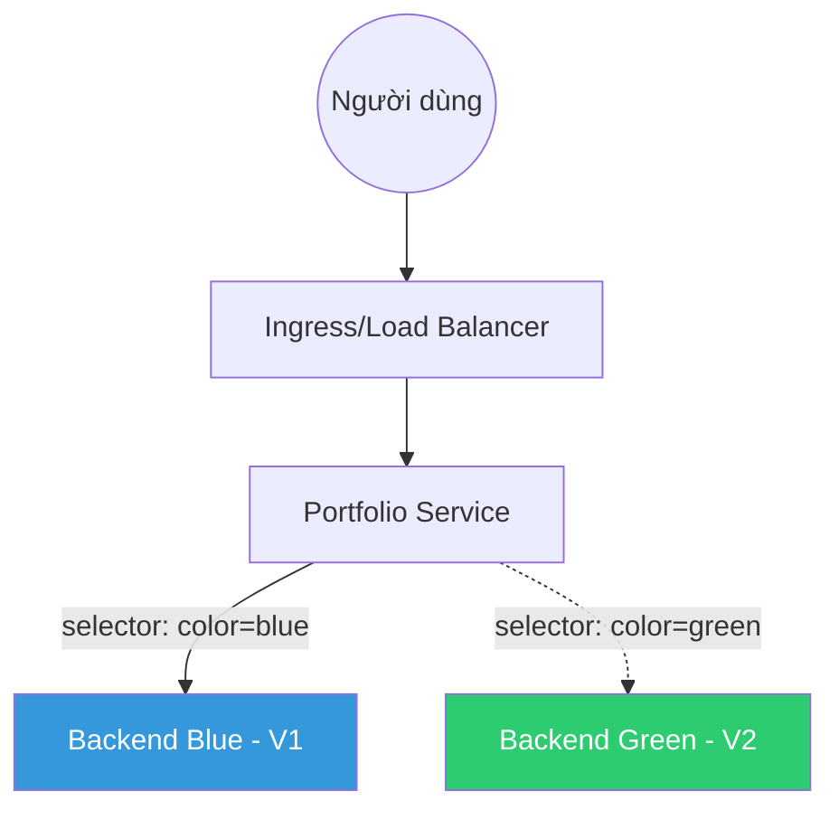

# Kế hoạch triển khai Blue-Green Deployment

Tài liệu này trình bày kế hoạch chuyển đổi hệ thống Portfolio từ mô hình cập nhật truyền thống (Rolling Update) sang mô hình **Blue-Green Deployment** để đạt được Zero-Downtime và khả năng Rollback tức thì.

## 1. Kiến trúc tổng thể

Mô hình Blue-Green yêu cầu duy trì hai môi trường Production song song nhưng chỉ có một môi trường nhận traffic thực tế.

- **Blue Environment**: Chạy phiên bản V1 (Hiện tại).
- **Green Environment**: Chạy phiên bản V2 (Mới).
- **Kubernetes Service**: Đóng vai trò là Load Balancer, điều hướng traffic dựa trên Label `color`.



## 2. Thay đổi về Kubernetes (K8s)

### 2.1 Cấu trúc Label
Tất cả các tài nguyên liên quan đến Backend/Frontend sẽ được gắn thêm nhãn nhận diện:
- `app: portfolio-backend`
- `color: blue` hoặc `color: green`

### 2.2 Service
Service chính sẽ không trỏ trực tiếp vào app mà trỏ qua màu sắc:
```yaml
spec:
  selector:
    app: portfolio-backend
    color: blue # Chỗ này sẽ được Script CI thay đổi khi Switch Traffic
```

## 3. Quy trình Pipeline (CI/CD) mới

Chúng ta vẫn giữ nguyên các bước Build, nhưng thay đổi hoàn toàn bước **Deploy Production**:

### Bước 1: Nhận diện môi trường (Identify Standby)
Script sẽ kiểm tra Service hiện tại đang trỏ vào màu nào:
- Nếu đang là `blue` -> Gán mục tiêu deploy là `green`.
- Nếu đang là `green` -> Gán mục tiêu deploy là `blue`.

### Bước 2: Deploy lên môi trường Standby
Triển khai phiên bản mới nhất lên môi trường đang chờ (Inactive). Môi trường Live vẫn hoạt động bình thường, người dùng không thấy sự thay đổi.

### Bước 3: Smoke Test (Kiểm tra nội bộ)
Hệ thống tự động thực hiện Health Check vào Endpoint riêng của môi trường Standby.

### Bước 4: Switch Traffic (Manual)
Trên GitLab sẽ xuất hiện nút bấm **"Switch Traffic to [Color]"**. Khi nhấn nút:
- Script thực hiện lệnh `kubectl patch svc ...` để thay đổi selector của Service.
- Traffic lập tức chuyển sang phiên bản mới.

### Bước 5: Rollback (Nếu cần)
Nếu phiên bản mới có lỗi, bạn chỉ cần nhấn nút **"Rollback to [Old Color]"** để gạt traffic quay lại môi trường cũ ngay lập tức.

## 4. Ưu và Nhược điểm

| Đặc điểm | Mô hình Hiện tại (Rolling) | Mô hình Blue-Green |
| :--- | :--- | :--- |
| **Downtime** | Rất thấp (giây) | **Bằng 0** |
| **Rollback** | Chậm (phải deploy lại bản cũ) | **Tức thì** (chỉ cần switch service) |
| **Tài nguyên** | Tiết kiệm | **Tốn gấp đôi** (phải chạy 2 bộ Pod) |
| **Độ phức tạp** | Thấp | Cao hơn |

## 5. Các bước triển khai tiếp theo

1.  **Review**: Bạn xem xét kế hoạch này và xác nhận.
2.  **Cấu trúc K8s**: Tôi sẽ tạo ra các file Template K8s mới hỗ trợ tham số `color`.
3.  **Script CI**: Viết Script `switch-traffic.sh` để thực hiện việc chuyển đổi.
4.  **Thử nghiệm**: Chạy thử nghiệm trên một môi trường Staging giả lập Blue-Green.

---
> [!IMPORTANT]
> Lưu ý: Do mô hình này chạy song song 2 bộ Pod, bạn cần đảm bảo cụm Kubernetes (Cluster) của mình có đủ tài nguyên (RAM/CPU) để chịu tải gấp đôi trong thời điểm chuyển đổi.
