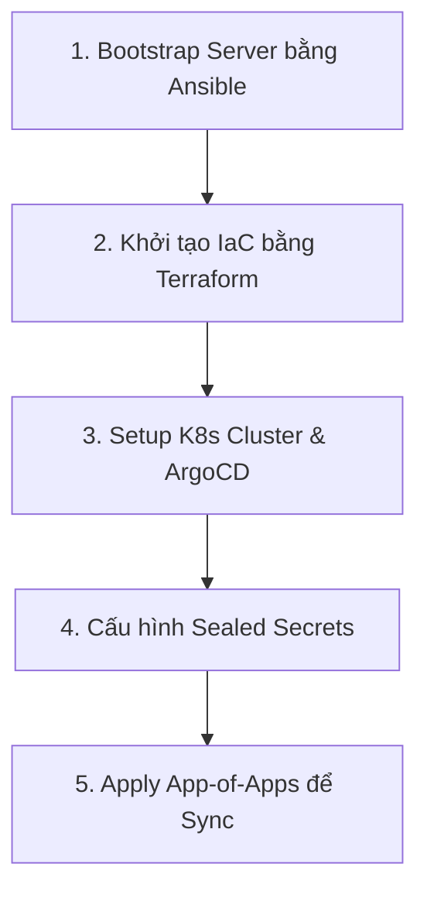

# 🌐 Portfolio Infrastructure (GitOps Production Edition)

Kho lưu trữ trung tâm quản lý toàn bộ Hạ tầng dưới dạng Code (**Infrastructure as Code - IaC**) và điều phối vận hành theo mô hình **GitOps** cho hệ thống Portfolio.

Mọi tài nguyên đám mây, cấu hình máy chủ, chính sách bảo mật, và tài nguyên điều phối Kubernetes được khai báo bằng code, đảm bảo tính nhất quán 100%, có thể kiểm toán và tự động phục hồi (self-healing).

---

## 💎 Điểm Nổi Bật & Tính Năng Vận Hành

*   **⚙️ Declarative IaC**: Quản lý toàn bộ tài nguyên Cloudflare (R2 Buckets, DNS, Zero Trust Application, Cloudflare Access) bằng **Terraform** chia theo mô hình modules và quản lý state tập trung trên Cloudflare R2.
*   **🤖 Host Automation**: Sử dụng **Ansible** để tự động hóa hoàn toàn quy trình bootstrap máy chủ (cài đặt Docker, cấu hình firewall, phân quyền hệ thống, và tối ưu hóa tham số nhân linux).
*   **🔄 App-of-Apps GitOps Pattern**: Sử dụng **ArgoCD** làm bộ điều phối GitOps chính. Cấu trúc ứng dụng được tổ chức theo mẫu *App-of-Apps*, giúp quản lý tập trung và đồng bộ hóa tự động tất cả các microservices và dịch vụ phụ trợ từ một manifest duy nhất.
*   **🛡️ Zero Trust Edge Security**:
    *   **Cloudflare Tunnel**: Kết nối an toàn cụm Kubernetes với mạng Cloudflare mà không cần mở cổng public inbound trên firewall máy chủ (No open ports).
    *   **Cloudflare Access**: Bảo vệ tất cả các trang quản trị nội bộ (ArgoCD, Grafana, K8s Dashboard) bằng mã OTP gửi qua email.
    *   **Sealed Secrets**: Mã hóa dữ liệu nhạy cảm một chiều bằng khóa bất đối xứng của cụm (Bitnami Sealed Secrets), cho phép lưu trữ an toàn các bí mật trực tiếp trên Git mà không sợ rò rỉ.
*   **📊 Observability Stack**: Tích hợp **Prometheus** thu thập metrics thời gian thực kết hợp với **Grafana** biểu diễn trực quan hiệu năng hệ thống (CPU, Memory, Traffic) và gửi cảnh báo tự động về kênh chat MS Teams/Telegram.
*   **⚡ Automated Disaster Recovery**: Lập lịch sao lưu tự động hàng ngày toàn bộ tài nguyên k8s và dữ liệu ứng dụng bằng **Velero**, nén và đẩy trực tiếp lên Cloudflare R2 để sẵn sàng khôi phục chỉ sau một lệnh.

---

## 🛠️ Công Nghệ Sử Dụng (Tech Stack)

*   **Provisioning & IaC:** Terraform
*   **Configuration Management:** Ansible
*   **GitOps Controller:** ArgoCD
*   **Kubernetes Ingress:** Traefik Ingress Gateway
*   **Secret Management:** Bitnami Sealed Secrets
*   **Monitoring:** Prometheus & Grafana Stack
*   **Backup & Recovery:** Velero & Cloudflare R2
*   **Security Border:** Cloudflare Access (Zero Trust)

---

## 📁 Cấu Trúc Thư Mục Hạ Tầng

```text
infra/
├── terraform/               # Mã nguồn Terraform IaC
│   ├── modules/             # Các module con tái sử dụng (cloudflare-r2, cloudflare-zero-trust)
│   └── environments/        # Cấu hình cụ thể cho staging & production
├── ansible/                 # Playbooks và Roles cấu hình hệ điều hành máy chủ
├── argocd/                  # Cấu hình ArgoCD (App of Apps, root application)
├── apps/                    # Kubernetes manifests cho các dịch vụ
│   ├── base/                # Cấu hình cơ sở chung cho ứng dụng
│   ├── monitoring/          # Helm values & manifests cho Prometheus/Grafana
│   └── platform/            # Cấu hình SealedSecrets, Traefik, Velero
├── environments/            # Tham số đè cấu hình ứng dụng theo từng môi trường
│   ├── staging/             # values.yaml và tag image cho Staging
│   └── production/          # values.yaml và tag image cho Production
└── docs/                    # Tài liệu cẩm nang vận hành và troubleshooting
```

---

## 🚀 Quy Trình Triển Khai Hệ Thống (Deployment Pipeline)

Quy trình bootstrap toàn bộ hạ tầng từ ban đầu được thực hiện theo 5 bước chuẩn hóa:



1.  **Bước 1: Cấu hình Máy chủ (Ansible):**
    Thực thi playbook để cấu hình môi trường máy chủ cơ sở:
    *Chi tiết xem tại:* [ansible/README.md](ansible/README.md) *(nếu có)* hoặc chạy lệnh:
    ```bash
    ansible-playbook -i ansible/inventory/hosts.yaml ansible/playbook.yaml
    ```

2.  **Bước 2: Khởi tạo Hạ tầng Đám mây (Terraform):**
    Truy cập thư mục môi trường và khởi tạo Cloudflare resources:
    ```bash
    cd terraform/environments/production
    terraform init
    terraform apply -var-file=terraform.tfvars
    ```

3.  **Bước 3: Khởi tạo ArgoCD trên K8s:**
    Áp dụng manifest cài đặt ArgoCD gốc lên cụm:
    ```bash
    kubectl create namespace argocd
    kubectl apply -n argocd -f https://raw.githubusercontent.com/argoproj/argo-cd/stable/manifests/install.yaml
    ```

4.  **Bước 4: Tạo Sealed Secrets:**
    Sử dụng công cụ `kubeseal` để mã hóa các biến nhạy cảm (như Database Password, JWT Secret) thành tệp `SealedSecret` rồi commit lên Git:
    ```bash
    kubeseal --format=yaml --cert=sealed-cert.pem < secret.yaml > sealed-secret.yaml
    ```

5.  **Bước 5: Kích hoạt GitOps Engine (App-of-Apps):**
    Áp dụng ứng dụng gốc (root application) để ArgoCD tự động quét và triển khai toàn bộ tài nguyên:
    ```bash
    kubectl apply -f argocd/root/app-of-apps.yaml
    ```

---

## 📖 Thư Viện Tài Liệu Vận Hành (Operational Manuals)

Vui lòng tham khảo các tài liệu chuyên sâu trong thư mục `docs/` để nắm rõ quy trình quản trị:

*   🇻🇳 **[Hướng Dẫn Vận Hành & Khắc Phục Sự Cố](docs/readme2.md)**: Cẩm nang xử lý các lỗi vận hành thường gặp, cập nhật IP và quản trị dịch vụ.
*   🇻🇳 **[Quy Trình Sao Lưu & Phục Hồi Velero](docs/velero-backup.md)**: Hướng dẫn chi tiết tạo lịch cronjob backup và khôi phục khi xảy ra sự cố phần cứng.
*   🇬🇧 **[Full English Deployment Guide (A-Z)](docs/README.md)**: Hướng dẫn triển khai chi tiết từng bước bằng tiếng Anh cho nhà phát triển mới.
*   🇻🇳 **[Thiết Kế Kiến Trúc IaC Terraform & R2](docs/terraform-r2.md)**: Chi tiết cấu hình các Cloudflare module, quản lý State File bảo mật.
*   🇻🇳 **[Tiêu Chuẩn Triển Khai Hệ Thống (Deployment Standards)](docs/DEPLOYMENT_STANDARDS.md)**: Quy chuẩn cấu hình tài nguyên QoS, Probes và bảo mật Pod.

---
*Vận hành và quản lý bởi đội ngũ GitOps Platform.*
